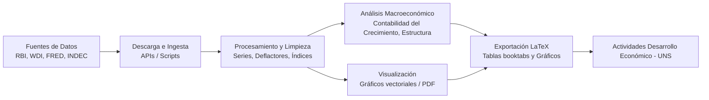

# Product Specification: MacroData Hub (Desarrollo Económico - UNS)

## 1. Visión General
Plataforma y entorno de trabajo para la descarga automatizada, limpieza, procesamiento, análisis econométrico/estadístico y visualización de datos macroeconómicos globales. 

El objetivo principal es servir como base analítica y generadora de insumos para las actividades prácticas, guías de estudio, informes y material de cátedra de la materia **Desarrollo Económico** de la carrera de **Licenciatura en Economía** en la **Universidad Nacional del Sur (UNS)**.

---

## 2. Alcance Geográfico y Fuentes de Datos

### 2.1 Enfoque Principal
* **India 🇮🇳 (Eje central):**
  * *Fuentes clave:* Reserve Bank of India (RBI), Ministry of Statistics and Programme Implementation (MOSPI), NITI Aayog, CMIE, World Bank Data.
  * *Variables típicas:* Crecimiento del PIB por sectores, empleo/desempleo (PLFS), pobreza y desigualdad, balanza de pagos, estructura productiva, inversión y ahorro.

### 2.2 Países de Comparación y Contexto
* **Estados Unidos 🇺🇸:**
  * *Fuentes clave:* FRED (Federal Reserve Bank of St. Louis), Bureau of Labor Statistics (BLS), Bureau of Economic Analysis (BEA).
  * *Rol:* Frontera tecnológica, benchmarks macroeconómicos internacionales y análisis de convergencia.
* **Argentina 🇦🇷:**
  * *Fuentes clave:* INDEC, Banco Central de la República Argentina (BCRA), Ministerio de Economía.
  * *Rol:* Comparación de patrones de desarrollo, heterogeneidad estructural, ciclos de stop-and-go e inflación.
* **Organismos Multilaterales (Cross-country):**
  * Banco Mundial (WDI), Fondo Monetario Internacional (FMI - WEO/IFS), Penn World Table (PWT), Naciones Unidas (UNDP - IDH).

---

## 3. Módulos y Funcionalidades del Sistema



### 3.1 Módulo de Ingesta y Descarga (`ingestion/`)
* Conectores y scripts modulares para APIs oficiales (World Bank API, FRED API, INDEC API, scrapers/descargadores de MOSPI/RBI).
* Almacenamiento local estructurado (`data/raw/` y `data/processed/`) con versionado o registro de fechas de descarga.

### 3.2 Módulo de Procesamiento y Estandarización (`processing/`)
* Homogeneización de periodicidades (mensual, trimestral, anual).
* Ajustes por inflación (deflactores implícitos, IPC, términos de intercambio).
* Conversión de monedas y tipos de cambio (PPA vs. tipo de cambio de mercado).
* Manejo de quiebres de series y cambios de año base metodológico.

### 3.3 Módulo de Análisis Macroeconómico (`analysis/`)
* **Contabilidad del crecimiento:** Descomposición de Solow, acumulación de factores vs. productividad total de los factores (PTF).
* **Cambio estructural:** Reasignación intersectorial del empleo y valor agregado (agricultura, industria, servicios).
* **Indicadores de desarrollo y bienestar:** Pobreza multidimensional, IDH, coeficientes de Gini, informalidad laboral.
* **Análisis comparativo / Convergencia:** Betas y sigmas de convergencia entre economías.

### 3.4 Módulo de Visualización (`plotting/`)
* Gráficos con calidad de publicación académica (paleta de colores sobria, tipografías consistentes, leyendas claras).
* Formatos de salida optimizados para documentos impresos/digitales (`.pdf`, `.eps`, `.png` en alta resolución).

### 3.5 Módulo de Exportación a LaTeX (`export_latex/`)
* Generación automática de tablas en sintaxis LaTeX compatible con `booktabs`, `tabularx` y `siunitx`.
* Exportación de gráficos con títulos, leyendas y notas al pie automáticas de fuentes.
* Plantillas y fragmentos modulares (`.tex`) listos para incluirse mediante `\input{...}` en el documento principal del curso.

---

## 4. Estructura de Directorios Recomendada

```text
desarrollo/
├── data/
│   ├── raw/                 # Datos brutos descargados
│   └── processed/           # Datos procesados y limpios
├── src/
│   ├── ingestion/           # Scripts de descarga y conexión con APIs
│   ├── processing/          # Limpieza, transformaciones y deflactación
│   ├── analysis/            # Modelos, descomposición y cálculos macro
│   ├── plotting/            # Generación de gráficos
│   └── export/              # Generadores de código y tablas LaTeX
├── output/
│   ├── figures/             # Gráficos exportados (PDF/PNG)
│   └── tables/              # Tablas en formato .tex
├── latex/                   # Documento / Guías de la materia (UNS)
├── notebooks/               # Notebooks exploratorios
├── product.md               # Especificación del proyecto
└── requirements.txt         # Dependencias del entorno
```

---

## 5. Criterios de Éxito
1. **Reproducibilidad:** Capacidad de regenerar todos los cuadros y gráficos del documento LaTeX a partir de los datos crudos con un solo comando o pipeline.
2. **Modularidad:** Facilidad para incorporar nuevas variables o países sin reescribir la lógica de procesamiento.
3. **Calidad de Salida:** Tablas y figuras listas para inserción directa en LaTeX cumpliendo estándares académicos y pedagógicos de la UNS.
